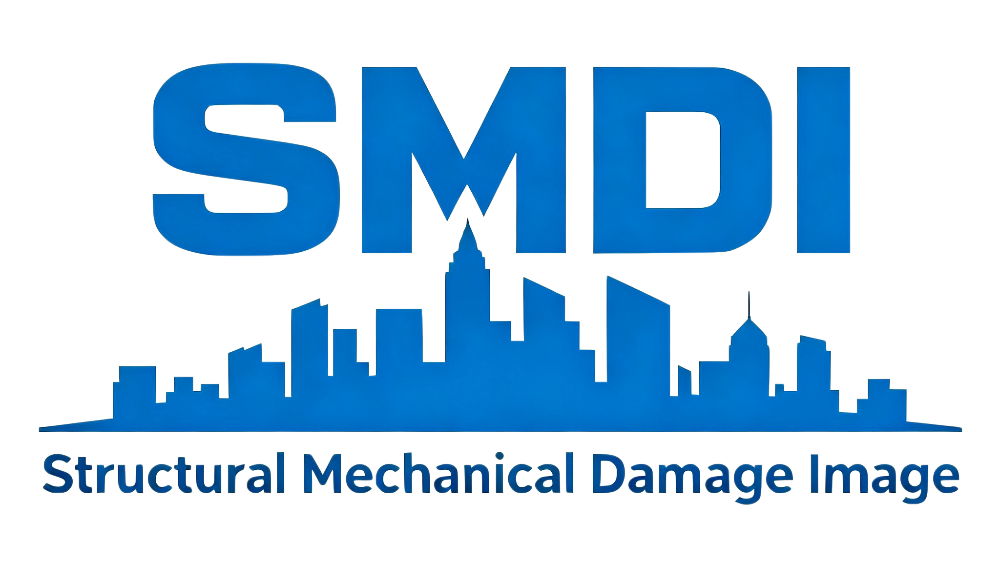

  

# 钢混结构力学损伤图像数据集
# **SMDI-Structural Mechanical Damage Image dataset**
The Reinforced Concrete Structural Mechanical Damage Image (SMDI) dataset is a companion resource for the post-earthquake Structural Damage Recognition Task (SDRT). It contains over 26,000 images with multi-class annotations.
